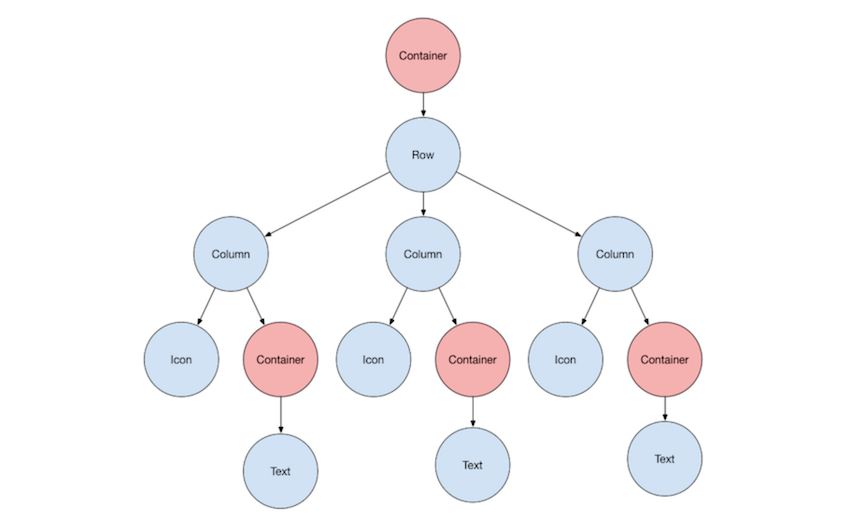
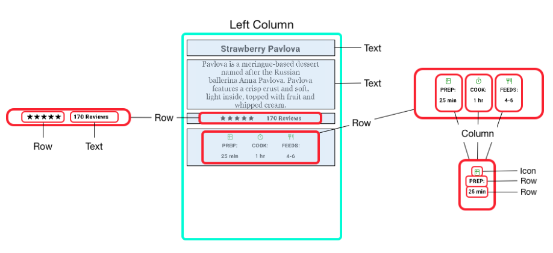

### HOW TO RELEASE FLUTTER APP IN 30 DAYS FOR THE BEGINNERS 

#### Ryoichi KATAOKA @LIFE PEPPER inc.  

Twitter: @je_suis_laterre  
LinkedIn: Ryoichi KATAOKA  
Github: cheapthrillandwine

---

### WHO AM I ?

**EXPERIENCE**:  
Software Developer(11/2018 - )  
Machine Learning Engineer(01/2018 - 01/2019)  

**LANGUAGE**:  
Python / JavaScript / React Native / Flutter 

**INTEREST**:  
Elm / Go

---

### Rec Loc Japan version 1.0   ON Release at 20/05/2019 !!!

---

### HOW MANY DEVELOPERS ?

FRONT END ==> **1**(ME)  
BACK  END ==> **2**(NOT FULL COMMIT)  

#### TOTAL **3** (LOL)

---

### HOW LONG TIME ?

ABOUT **30** DAYS

--- 

### DIFFICULTY

- Widget
- Video
- Nested JSON Parsing

--- 

### WHAT IS THE WIDGET !!??
🤔
 
+++

### TREE ??

###### (https://flutter.dev/docs/development/ui/layout)

+++

🤔

+++

### MY UNDERSTANDING...

+++

### BOX !!

###### (https://flutter.dev/docs/development/ui/layout)

---

### HOW TO PLAY VIDEO STREAMING ??
😇

+++

### video_player ??
Github:[video_player](https://github.com/flutter/plugins/tree/master/packages/video_player)

- Loading Slowly
- Streaming Sometimes Stop
- Unstable

+++

### 😢

+++ 

### Chewie
Github:[chewie](https://github.com/brianegan/chewie)

- Loading 10s ==> 0.5s
- Streaming Smooth
- Stable

+++

### Demo

https://twitter.com/je_suis_laterre/status/1131071329275301888

### 🤗

---

### HOW TO JSON PARSING ?
😦

+++

### NESTED JSON

---?code=sample.json&lang=json&color=#1E1F21&title=Nested JSON
